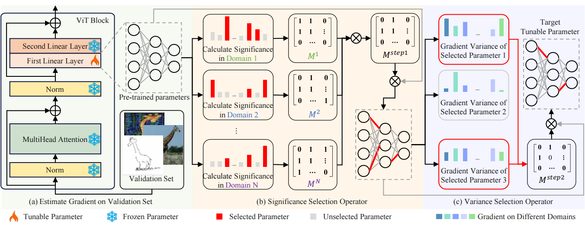

# JPS: Joint Parameter Selection (TMM2026)

Official PyTorch implementation of [Preserving Domain Generalization in Fine-Tuning via Joint Parameter Selection](accepted but not published yet)

Bin Pan, Shiyu Shen, Zongbin Wang, Zhenwei Shi and Xia Xu.

[paper](open access after publication)



## Preparation

### Dependencies

```sh
pip install -r requirements.txt
```

### Datasets

```sh
# data_dir could be changed, default is ./data
python -m domainbed.scripts.download --data_dir=./data
```

### Environments

Environment details used for the main experiments.

```yml
Environment:
    Python: 3.8.17
    PyTorch: 2.0.1
    Torchvision: 0.15.2
    CUDA: 11.7
    CUDNN: 8500
    NumPy: 1.22.0
    PIL: 9.4.0
```

## How to Run

`train_all.py` script conducts multiple leave-one-out cross-validations for all target domain.

```bash
# sbatch train.sh if you have slurm
bash train.sh
```

### Change dataset

You can run JPS on different dataset by changing `Line 12`:

```bash
# [PACS, VLCS, OfficeHome, TerraIncognita, DomainNet]
dataset=OfficeHome
```

### Change backbones

You can run JPS with different backbones by changing `Line 15`:

```bash
# [resnet50, clip_resnet50, clip_vit-b16]
model=clip_vit-b16
```

### Choose selection layers

You can run JPS with different backbones by changing `Line 18`. Make sure you first refer to `./results/xxx_structure.out` to find the correct layer names.

```bash
# select_name should be chosen according to ./results/xxx_structure.out, default is ViT L=8 only last mlp
select_name="11.mlp.c_fc 10.mlp.c_fc 9.mlp.c_fc 8.mlp.c_fc 7.mlp.c_fc 6.mlp.c_fc 5.mlp.c_fc 4.mlp.c_fc"
```

### Check results

After training, refer to `./train_output/"$dataset"/"$start_time"/log.txt` last line to get the target domain accuracies. For example, `./train_output/PACS/251216_14-27-30_exp_name/log.txt`

### Our searched HPs

|                     | PACS  | VLCS  | OfficeHome | TerraIncognita | DomainNet |
| ------------------- | ----- | ----- | ---------- | -------------- | --------- |
| Learning rate       | 8e-5  | 8e-5  | 8e-5       | 5e-5           | 8e-5      |
| Dropout rate        | 0.5   | 0.3   | 0.0        | 0.8            | 0.1       |
| $\rho$              | 0.001 | 0.001 | 0.0001     | 0.2            | 0.0005    |
| Validation set size | 10    | 10    | 20         | 50             | 10        |
| Batch size          | 32    | 32    | 32         | 32             | 20        |

## License

This project is released under the MIT license, included [here](./LICENSE).

This project include some code from [facebookresearch/DomainBed](https://github.com/facebookresearch/DomainBed) (MIT license), [khanrc/swad](https://github.com/khanrc/swad) (MIT license) and [khanrc/miro](https://github.com/khanrc/miro) (MIT license).
